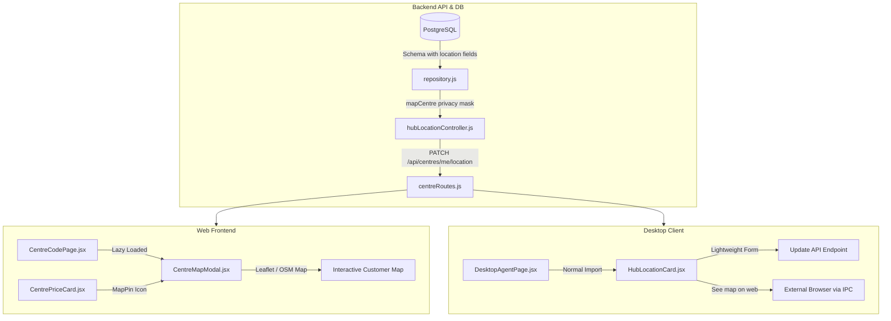

# Hub Location & Interactive Map Feature

A comprehensive overview of the PrintEase Hub Location settings and interactive customer map feature. This feature allows print hubs to opt-in to location exposure, edit their physical address and coordinates, and allows customers to view nearby centres on a map.

---

## 1. Feature Architecture

The location feature is implemented with a clear separation between the Web MVP and the Desktop client to ensure optimal performance, security, and minimal bundle footprint.



---

## 2. Database Schema & Migration

The print hub location coordinates, addresses, and state are stored in the `print_hubs` table in the PostgreSQL database.

### Schema Columns Added (`print_hubs`)
```sql
-- Hub location fields (safe, all nullable or with defaults)
alter table print_hubs add column if not exists location_enabled boolean not null default false;
alter table print_hubs add column if not exists latitude numeric(10,7);
alter table print_hubs add column if not exists longitude numeric(10,7);
alter table print_hubs add column if not exists address_text text;
alter table print_hubs add column if not exists area text;
alter table print_hubs add column if not exists city text;
alter table print_hubs add column if not exists map_updated_at timestamptz;
```

### Performance Optimization Index
An index is created to optimize lookups for active, location-enabled centres on the map:
```sql
create index if not exists idx_print_hubs_location_enabled 
on print_hubs(location_enabled) 
where location_enabled = true;
```

---

## 3. Backend Implementation & Security Rules

### API Endpoint: `PATCH /api/centres/me/location`
- **Method:** `PATCH`
- **Route:** `/api/centres/me/location`
- **Authentication:** Required (`authMiddleware`)
- **Authorization:** Hub owners only (`roleMiddleware('hub')`)
- **Handler Location:** [hubLocationController.js](file:///home/adisssss/Desktop/web_dev/printhub/printease-mvp-main/backend/src/controllers/hubLocationController.js)

### Input Validation & Sanitization
1. **Latitude Validation:** Must be a valid number between `-90` and `90` (or `null`/empty).
2. **Longitude Validation:** Must be a valid number between `-180` and `180` (or `null`/empty).
3. **Location Requirement:** If `locationEnabled` is toggled `true`, both `latitude` and `longitude` are strictly required.
4. **Text Sanitization:** The `addressText`, `area`, and `city` inputs are trimmed, sanitized, and capped at `300` characters to prevent buffer overflow or database insertion anomalies.

### Coordinate Exposure Privacy Rule
To ensure maximum privacy for print hub owners who do not wish to expose their physical coordinates:
- The backend's public queries map raw hub database rows through the `mapCentre(row)` function in [repository.js](file:///home/adisssss/Desktop/web_dev/printhub/printease-mvp-main/backend/src/db/repository.js).
- If `location_enabled` is `false`, the values of `latitude` and `longitude` are masked and returned as `null` in the public API response. This prevents any private hub coordinates from being leaked when the feature is disabled.

---

## 4. Web Frontend (Leaflet + OpenStreetMap)

The customer-facing web app offers a fully interactive map view using **Leaflet** and **OpenStreetMap** (OSM).

### Lazy Loading and Bundle Isolation
> [!IMPORTANT]
> The interactive map module [CentreMapModal.jsx](file:///home/adisssss/Desktop/web_dev/printhub/printease-mvp-main/frontend/src/components/CentreMapModal.jsx) is lazy-loaded using `React.lazy()` and `<Suspense>` inside [CentreCodePage.jsx](file:///home/adisssss/Desktop/web_dev/printhub/printease-mvp-main/frontend/src/pages/CentreCodePage.jsx).
>
> This guarantees that the heavy Leaflet libraries are split into an isolated async chunk (e.g., `CentreMapModal-[hash].js`) during build time, preventing these libraries from polluting the main JavaScript bundle of the desktop client.

### Features
1. **Nearby Hub Markers:** Pins location-enabled centres on the map.
2. **Status Color Coding:**
   - **Green marker:** Hub printer is online/available.
   - **Orange marker:** Hub printer is offline/unavailable.
3. **Interactive Popups:** Clicking a marker displays:
   - Hub Name and Centre Code.
   - Address, Area, and City.
   - Current printing rates (B/W Single/Double, Color Single/Double).
   - "Upload to this Centre" button which selects the hub and navigates back to the upload page.
4. **"My Location" Geolocation Helper:** Detects the user's current coordinates using `navigator.geolocation` and zooms the map to their position. A privacy notice clarifies that this information is never transmitted or stored on the server.

### Installation / Dependency Management
Due to React 19 dependency resolution changes, the Leaflet packages must be installed with peer dependency overrides:
```bash
npm install leaflet@^1.9.4 react-leaflet@^4.2.1 --legacy-peer-deps
```

---

## 5. Desktop Frontend (Lightweight Design)

To ensure the desktop app starts up instantly and does not ship heavy map libraries in its application bundle, **no map UI is integrated into the desktop application.**

### Hub Location Card
A lightweight component [HubLocationCard.jsx](file:///home/adisssss/Desktop/web_dev/printhub/printease-mvp-main/frontend/src/components/HubLocationCard.jsx) is rendered in [DesktopAgentPage.jsx](file:///home/adisssss/Desktop/web_dev/printhub/printease-mvp-main/frontend/src/pages/DesktopAgentPage.jsx) for logged-in hubs. It provides:
1. **Show my shop on map (ON/OFF):** Toggle switch to control global visibility.
2. **Landmark / Address / Area / City fields:** Simple inputs for hub details.
3. **Latitude & Longitude coordinates:** Editable inputs for geographic coordinates.
4. **"Use my current location" button:** Detects coordinates locally using `navigator.geolocation` and fills the latitude/longitude fields (coordinates are not saved until the user clicks "Save").
5. **See map on web ↗:** Button that opens the web app in the user's external web browser.

### External Link Routing via Electron IPC
When clicking "See map on web ↗" inside the Desktop client, the app uses the `isDesktop()` check and routes the URL to the default web browser using the IPC bridge:
- [desktopBridge.js](file:///home/adisssss/Desktop/web_dev/printhub/printease-mvp-main/frontend/src/utils/desktopBridge.js) calls:
  ```javascript
  window.printeaseDesktop.openExternalUrl(url)
  ```
- This triggers the Electron IPC `desktop:open-external-url` handler configured inside the Desktop main/preload script:
  ```javascript
  ipcMain.handle('openExternalUrl', async (_, url) => {
    const safe = url.startsWith('https://') || url.startsWith('http://');
    if (!safe) return { success: false, error: 'Unsafe URL' };
    await shell.openExternal(url);
    return { success: true };
  });
  ```

---

## 6. Verification and Commands

### Backend Validation
Validate syntax and run tests:
```bash
node --check backend/src/controllers/hubLocationController.js
npm test --prefix backend
```

### Bundle Size & Footprint Analysis
Verify that Vite correctly splits the Leaflet map assets from the core bundle:
```bash
npm run build --prefix frontend
```
Upon a successful build, the output will log `CentreMapModal` as an isolated dynamic chunk. Checking for the string `"leaflet"` in the root application chunks should return no matches, ensuring the desktop app shell starts up clean without any map payload.
